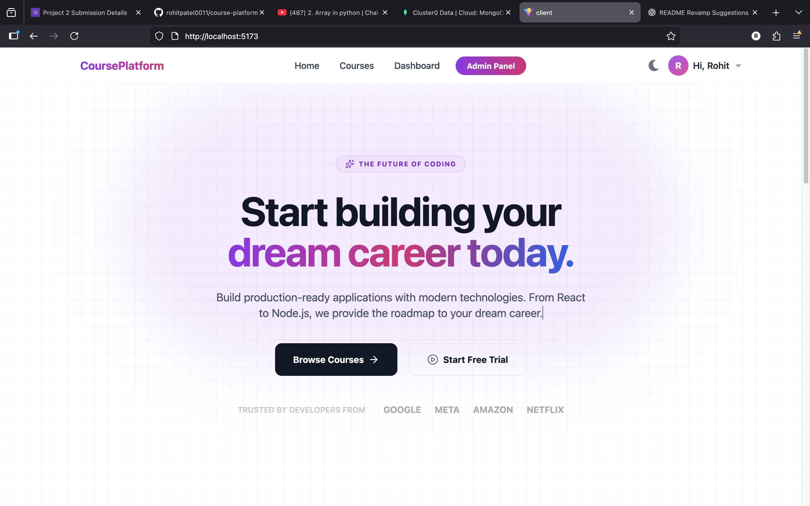
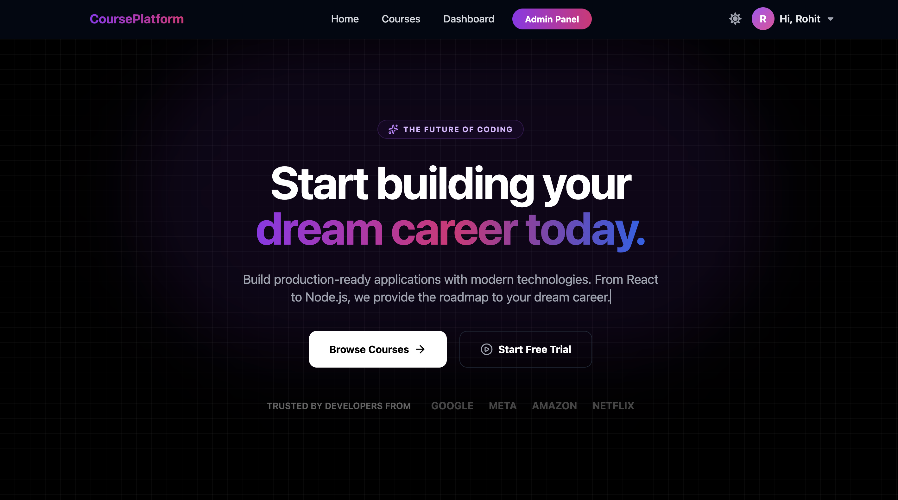
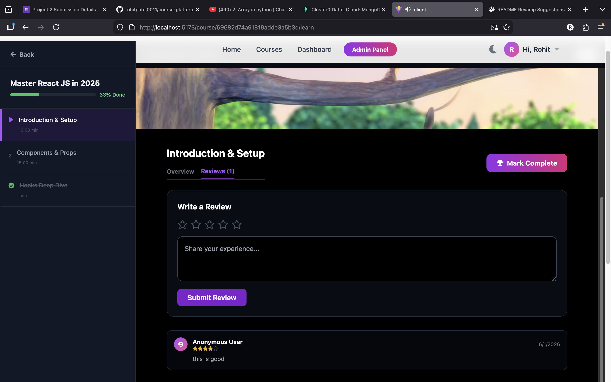
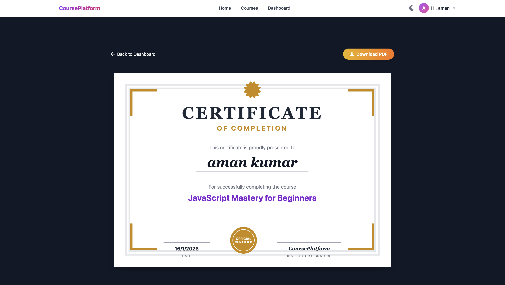

# 🎓 Enginow – E-Learning Platform


Enginow is a full-stack **Learning Management System (LMS)** built as a **project 2 Project**.
It allows users to explore courses, purchase them using **Razorpay**, watch video lessons, track learning progress, and download certificates after course completion.

---
## 🚀 Live Demo

- **Frontend (Vercel):** https://course-platform-one.vercel.app/
- **Backend (Render):** https://course-platform-bx74.onrender.com/

---

## ✨ Features

- 🔐 Secure authentication (Login / Signup) using **JWT**
- 📚 Admin course management (Create, Update, Delete)
- 🎥 Video course player with progress tracking
- 💳 Online course purchase using **Razorpay**
- ⭐ Course ratings and reviews
- 🏆 Auto-generated certificate after 100% completion
- 🌗 Light & Dark mode support
- 📱 Fully responsive design (Mobile & Desktop)

---

## 🖼️ Screenshots

### Home Page (Light Mode)


### Home Page (Dark Mode)


### Course Player


### Certificate


---

## 🛠️ Tech Stack

### Frontend
- React.js
- Tailwind CSS
- Vite

### Backend
- Node.js
- Express.js

### Database
- MongoDB Atlas

### Payment Gateway
- Razorpay

### Deployment
- Vercel (Frontend)
- Render (Backend)

---

## 🧠 System Architecture

```text
User
 ↓
React Frontend (Vite + Tailwind)
 ↓ REST API (JWT Auth)
Node.js + Express Backend
 ↓
MongoDB Atlas
 ↓
Razorpay Payment Gateway

```


## 📂 Project Structure

```text
.
├── Home.png
├── HomeDark.png
├── Player.png
├── Certification.png
├── client
│   ├── src
│   │   ├── pages
│   │   ├── components
│   │   ├── context
│   │   └── services
│   └── package.json
└── server
    ├── src
    │   ├── controllers
    │   ├── models
    │   ├── routes
    │   └── middlewares
    └── server.js
```

---

## ⚙️ Installation & Setup

### 1️⃣ Clone Repository

```bash
git clone https://github.com/your-username/enginow.git
```

### 2️⃣ Install Dependencies

**Frontend**

```bash
cd client
npm install

```

**Backend**

```bash
cd ../server
npm install
```

---

### 3️⃣ Environment Variables

Create a `.env` file inside the **server** folder:

```env
MONGO_URI=your_mongodb_connection_string
JWT_SECRET=your_jwt_secret
RAZORPAY_KEY_ID=your_razorpay_key_id
RAZORPAY_KEY_SECRET=your_razorpay_key_secret
```
---

### 4️⃣ Run Project Locally

**Backend**

```bash
npm run dev
```

**Frontend**

```bash
npm run dev
```

---

## 🎯 Project Objective

* Build a real-world **full-stack LMS**
* Implement secure authentication & authorization
* Integrate a real **payment gateway**
* Track user learning progress
* Generate certificates automatically

---

## 📌 Resume Description

**Enginow – Full Stack E-Learning Platform**

* Developed a complete LMS using React, Node.js, Express, and MongoDB
* Implemented JWT-based authentication and Razorpay payment integration
* Added video progress tracking and auto certificate generation
* Deployed frontend on Vercel and backend on Render

---

## 👨‍💻 Author

**Rohit Patel**
Full Stack Developer

📧 Email: [rajgolu636@gmail.com](mailto:rajgolu636@gmail.com)
📱 Phone: +91 8709635920

---

## ⭐ Support

If you like this project, please give it a ⭐ on GitHub.

```
```
